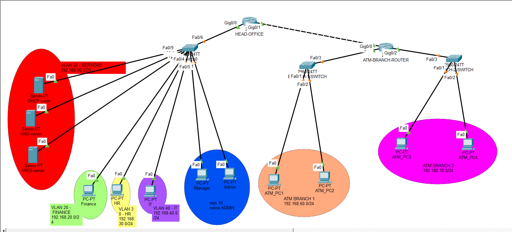
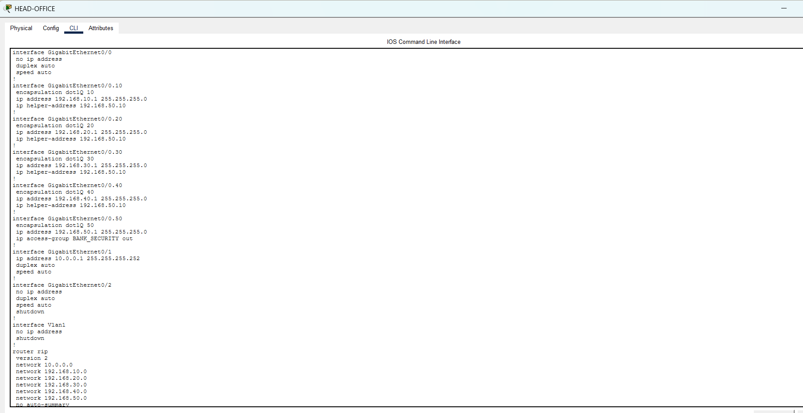
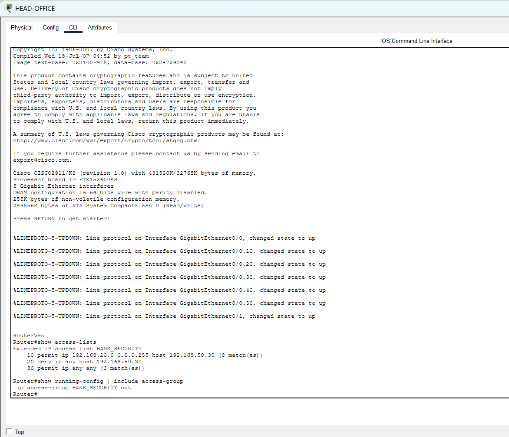
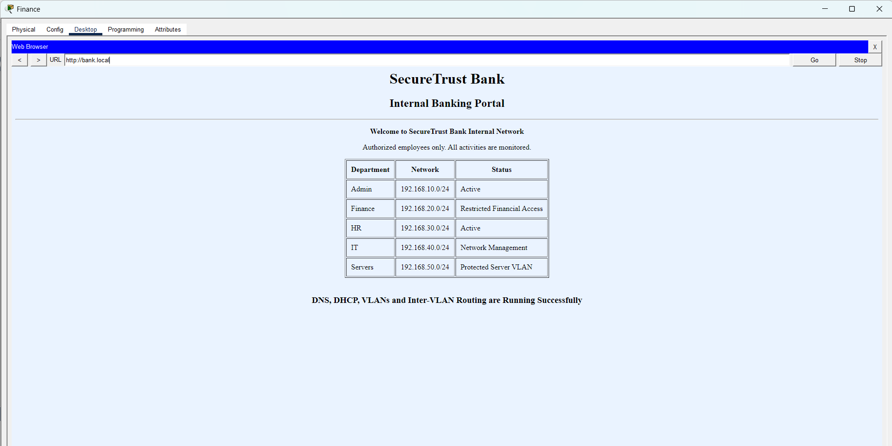

# 🏦 SecureTrust Bank Network Design and Simulation

> **Cisco Packet Tracer | SZABIST Islamabad | CNDC Lab Project**



---

## 📋 Table of Contents

- [Project Overview](#-project-overview)
- [Network Topology](#-network-topology)
- [Features Implemented](#-features-implemented)
- [IP Addressing Scheme](#-ip-addressing-scheme)
- [VLAN Configuration](#-vlan-configuration)
- [DHCP Configuration](#-dhcp-configuration)
- [ACL Security](#-acl-security)
- [Web Server & DNS](#-web-server--dns)
- [Simulation Results](#-simulation-results)
- [Tools Used](#-tools-used)
- [Author](#-author)

---

## 📌 Project Overview

This project presents the **design and simulation of a secure enterprise banking network** for **SecureTrust Bank** using Cisco Packet Tracer. The network covers a Head Office with multiple departments, a centralized server VLAN, and two remote ATM branch networks — all interconnected and secured with industry-standard networking techniques.

| Detail | Info |
|---|---|
| **Institution** | Shaheed Zulfikar Ali Bhutto Institute of Science & Technology (SZABIST-ISB) |
| **Course** | CNDC Lab |
| **Instructor** | Sir Muhammad Farooq |
| **Student** | Wahid Ali |
| **Reg. No.** | 2312186 |
| **Tool** | Cisco Packet Tracer |

---

## 🗺️ Network Topology

The network consists of:
- **1 Head Office Router** (Cisco 2911) — handles inter-VLAN routing & RIP v2
- **1 ATM Branch Router** (Cisco 2911) — connects two remote ATM branches
- **3 Switches** (Cisco 2960-24TT) — one at HQ, one per ATM branch
- **3 Servers** — DHCP, DNS, and Web (hosted in VLAN 50 – Servers)
- **8 PCs** — department clients + ATM branch clients

```
                        HEAD-OFFICE ROUTER
                        /               \
               HQ-SWITCH            ATM-BRANCH-ROUTER
              /  |  |  |  \           /            \
          VLAN VLAN VLAN VLAN VLAN  ATM-1-SW    ATM-2-SW
           10   20   30   40   50  (Branch 1)  (Branch 2)
```


---

## ✅ Features Implemented

| # | Feature | Status |
|---|---------|--------|
| 1 | VLAN Segmentation (5 VLANs) | ✅ Done |
| 2 | Inter-VLAN Routing (Router-on-a-Stick) | ✅ Done |
| 3 | DHCP Server (centralized, multi-pool) | ✅ Done |
| 4 | DNS Server (bank.local resolution) | ✅ Done |
| 5 | HTTP Web Server (Internal Banking Portal) | ✅ Done |
| 6 | RIP Version 2 Dynamic Routing | ✅ Done |
| 7 | Extended ACL Security (BANK_SECURITY) | ✅ Done |
| 8 | ATM Branch Connectivity (2 remote branches) | ✅ Done |

---

## 🌐 IP Addressing Scheme

| Network / VLAN | Department | Network Address | Default Gateway | Subnet Mask |
|---|---|---|---|---|
| VLAN 10 | Admin | 192.168.10.0/24 | 192.168.10.1 | 255.255.255.0 |
| VLAN 20 | Finance | 192.168.20.0/24 | 192.168.20.1 | 255.255.255.0 |
| VLAN 30 | HR | 192.168.30.0/24 | 192.168.30.1 | 255.255.255.0 |
| VLAN 40 | IT | 192.168.40.0/24 | 192.168.40.1 | 255.255.255.0 |
| VLAN 50 | Servers | 192.168.50.0/24 | 192.168.50.1 | 255.255.255.0 |
| ATM Branch 1 | ATM Network 1 | 192.168.60.0/24 | 192.168.60.1 | 255.255.255.0 |
| ATM Branch 2 | ATM Network 2 | 192.168.70.0/24 | 192.168.70.1 | 255.255.255.0 |
| Router Link | HQ ↔ ATM Router | 10.0.0.0/30 | 10.0.0.1 / 10.0.0.2 | 255.255.255.252 |

---

## 🔀 VLAN Configuration

Five VLANs were configured on the Head Office switch to logically separate departments:

| VLAN ID | Name | Assigned Devices | Purpose |
|---|---|---|---|
| 10 | ADMIN | Admin PC, Manager PC | Administrative communication |
| 20 | FINANCE | Finance PC | Financial department (restricted access) |
| 30 | HR | HR PC | Human resources communication |
| 40 | IT | IT PC | Network management & technical support |
| 50 | SERVERS | DHCP, DNS, Web servers | Centralized network services (protected) |

Inter-VLAN routing was implemented using the **Router-on-a-Stick** method with IEEE 802.1Q encapsulation on sub-interfaces:

```
GigabitEthernet0/0.10  →  VLAN 10  →  192.168.10.1
GigabitEthernet0/0.20  →  VLAN 20  →  192.168.20.1
GigabitEthernet0/0.30  →  VLAN 30  →  192.168.30.1
GigabitEthernet0/0.40  →  VLAN 40  →  192.168.40.1
GigabitEthernet0/0.50  →  VLAN 50  →  192.168.50.1
```

---

## 📡 DHCP Configuration

A centralized DHCP server (192.168.50.10) in VLAN 50 automatically assigns IP addresses to all client PCs across VLANs using **ip helper-address** on router sub-interfaces.



| Pool Name | Default Gateway | DNS Server | Start IP |
|---|---|---|---|
| ADMIN | 192.168.10.1 | 192.168.50.20 | 192.168.10.10 |
| FINANCE | 192.168.20.1 | 192.168.50.20 | 192.168.20.10 |
| HR | 192.168.30.1 | 192.168.50.20 | 192.168.30.10 |
| IT | 192.168.40.1 | 192.168.50.20 | 192.168.40.10 |
| ATM Branch 1 | 192.168.60.1 | 192.168.50.20 | 192.168.60.10 |
| ATM Branch 2 | 192.168.70.1 | 192.168.50.20 | 192.168.70.10 |

---

## 🔒 ACL Security

An **Extended Access Control List** named `BANK_SECURITY` was configured on the Head Office router and applied **outbound** on the `GigabitEthernet0/0.50` (Server VLAN) interface.



```
Extended IP access list BANK_SECURITY
    10  permit ip 192.168.20.0 0.0.0.255 host 192.168.50.30
    20  deny   ip any host 192.168.50.30
    30  permit ip any any
```

**Policy:** Only the Finance VLAN (192.168.20.0/24) is explicitly permitted to reach the web server at 192.168.50.30. All other hosts are denied direct access to the protected web server, while general traffic is permitted.

---

## 🌍 Web Server & DNS



- **Web Server IP:** `192.168.50.30`
- **DNS Server IP:** `192.168.50.20`
- **Domain:** `bank.local` → resolves to `192.168.50.30`

The internal banking portal was successfully accessed from the Finance PC by navigating to `http://bank.local`, confirming that **DNS resolution, inter-VLAN routing, DHCP, and HTTP services** are all functioning correctly together.

| Service | Server IP | Domain | Status |
|---|---|---|---|
| HTTP Web Server | 192.168.50.30 | bank.local | ✅ Active |
| DNS Mapping | 192.168.50.20 | bank.local → 192.168.50.30 | ✅ Active |

---

## 📊 Simulation Results

All major components were tested and verified:

| Test | Method | Result |
|---|---|---|
| VLAN Segmentation | `show vlan brief` | ✅ All 5 VLANs active with correct ports |
| DHCP Assignment | `ipconfig` on client PCs | ✅ Correct IPs assigned per VLAN pool |
| DNS Resolution | `ping bank.local` | ✅ Resolved to 192.168.50.30 |
| Web Server Access | Browser → `http://bank.local` | ✅ Banking portal loaded successfully |
| RIP v2 Routing | `show ip route` | ✅ ATM branch routes (R) visible at HQ |
| ACL Security | `show access-lists` | ✅ BANK_SECURITY applied, traffic filtered |

---

## 🛠️ Tools Used

- **Cisco Packet Tracer** — Network simulation
- **Cisco 2911 Router** — Inter-VLAN routing & RIP v2
- **Cisco 2960-24TT Switch** — VLAN switching & trunking
- **Server-PT** — DHCP, DNS, HTTP services
- **PC-PT** — Client end devices

---

## 📁 Repository Contents

| File | Description |
|---|---|
| `SecureTrust-Bank.pkt` | Cisco Packet Tracer project file |
| `topology.png` | Full network topology diagram |
| `DHCP.png` | DHCP address assignment verification |
| `ACL.png` | ACL configuration & verification |
| `bankserver.png` | Internal banking web portal screenshot |
| `README.md` | Project documentation |

---

## 👨‍💻 Author

**Wahid Ali**  
BS Computer Science — Semester 6  
SZABIST Islamabad  
Reg. No: 2312186

---

> *This project was developed as part of the CNDC Lab course at SZABIST Islamabad. All configurations were simulated in Cisco Packet Tracer for educational purposes.*
